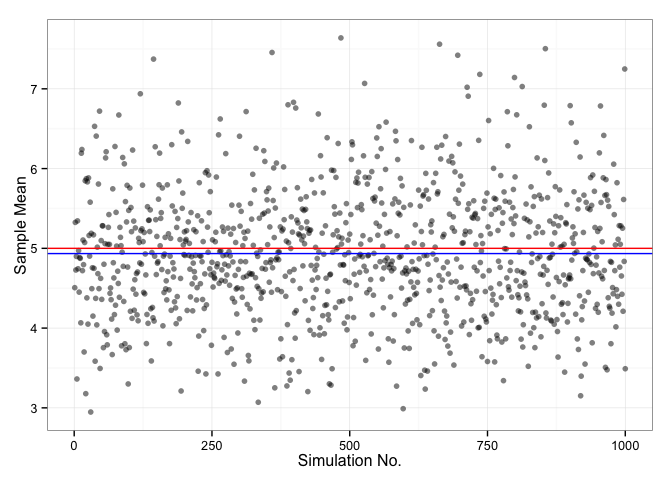
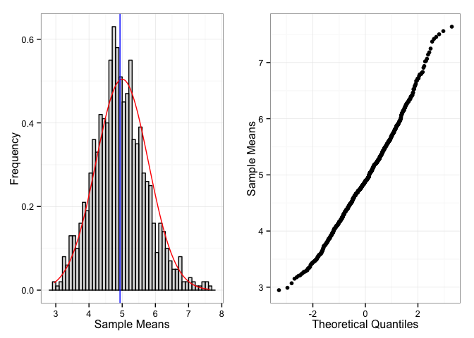

# Statistical Inference : Project : Exponential Distribution Properties
courserans  
February 20, 2015  

#### Overview

In this project we will investigate the properties of the exponential distribution in R. We will use the rexp(n = 40 ,lambda = 0.2) R function to generate the exponential random deviates for 1000 simulations. 

* Show the sample mean and compare it to the theoretical mean of the distribution.
* Show how variable the sample is (via variance) and compare it to the theoretical variance of the distribution.
* Show that the distribution is approximately normal.

#### Simulations

```r
nosim <- 1000
n <- 40
lambda <- 0.2
set.seed(1400) 

sample.mean <- NULL
for (i in 1:nosim) {
    sample.mean[i] <- mean(rexp(n,lambda))
}
```
####  Sample Mean versus Theoretical Mean


```r
Theoretical.mean <- 1/lambda
Observed.mean <- mean(sample.mean)
```
* Theoretical mean of the exponential distribution with n=40, lambda = 0.2 is : 5
* Sample mean from 1000 simulation of exponential distribution(n=40, lambda=0.2) is : 4.9343507


```r
library(ggplot2)
dat <- as.data.frame(sample.mean)
g <- ggplot(dat, aes(x = 1:1000, y=sample.mean)) + geom_point(alpha = .5)
g <- g + geom_hline(yintercept = (1/lambda), color = "red")
g <- g + geom_hline(yintercept = mean(sample.mean), color = "blue")
g <- g + labs(x = "Simulation No.", y = "Sample Mean")
g <- g + theme_bw()
g
```


Fig1 : Scatter plot of sample means of ith ( 1 to 1000) simulation run. The red line indicates the theoretical mean. The blue line indicates the observed sample mean. Please note the closeness of theoretical and sample mean. 

#### Sample Variance versus Theoretical Variance

```r
Theoretical.variance <- (1/lambda)^2/n
Observed.variance <- var(sample.mean)
```
* Theoretical Variance of the exponential distribution with n=40, lambda = 0.2 is : 0.625
* Sample variance from 1000 simulation of exponential distribution(n=40, lambda=0.2) is : 0.6270084

#### Distribution : CLT


```r
library(grid)
library(gridExtra)

g1 <- ggplot(dat, aes(x = sample.mean)) + geom_histogram(alpha = .20, binwidth=.1, colour = "black",aes(y = ..density..)) 
g1 <- g1 + stat_function(fun = dnorm, colour = "red", arg = list(mean = Theoretical.mean, sd=sqrt(Theoretical.variance)))
g1 <- g1 + geom_vline(xintercept = mean(sample.mean), color = "blue")
g1 <- g1 + labs(x = "Sample Means", y = "Frequency")
g1 <- g1 + theme_bw()

g2 <- ggplot(dat, aes(sample = sample.mean)) + stat_qq()
g2 <- g2 + labs(x = "Theoretical Quantiles", y = "Sample Means")
g2 <- g2 + theme_bw()

grid.arrange(g1,g2,ncol=2)
```


Fig 2: The left panel shows a histogram of the sample means for 1000 different random samples. The red curve indicates a normal density function (mu - 5, variance - 0.625). The blue vertical line is the observed sample mean of 4.9343507. The right panel shows a normal probability plot of those sample means.

##### Conclusion : As we note in Fig 2 above the distribution of sample means pretty closely resembles a normal distibution. A normal probability plot of the sample means also closely form around a straight line. Therefore we can conclude the distribution of sample means is nearly normal. This result can be explained by the Central Limit Theorem. 
